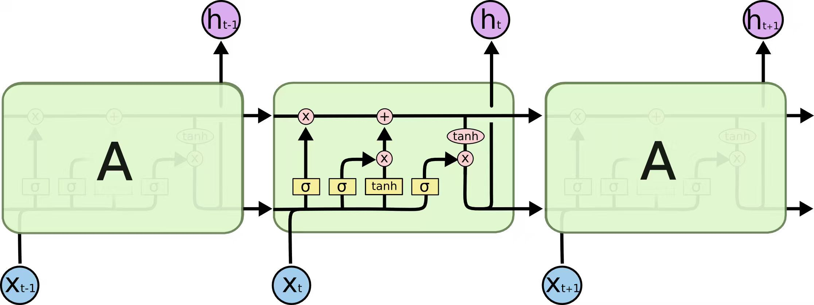

# 1 Assignment Overview
In this assignment, you will build all the components needed to train a standard Transformer language model (LM) from scratch and train some models.

## What you will implement

1. Byte-pair encoding (BPE) tokenizer (§2)
2. Transformer language model and LSTM (§3)
3. The cross-entropy loss function and the AdamW optimizer (§4)
4. The training loop, with support for serializing and loading model and optimizer state (§5)

## What you will run

1. Train a BPE tokenizer on the TinyStories dataset.
2. Run your trained tokenizer on the dataset to convert it into a sequence of integer IDs.
3. Train the Transformer and LSTM on the TinyStories dataset.
4. Generate samples and evaluate perplexity using the trained Transformer LM and LSTM.

## What you can use

We expect you to build these components from scratch. In particular, you may not use any definitions from `torch.nn`, `torch.nn.functional`, or `torch.optim` except for the following:

- `torch.nn.Parameter`

- Container classes in `torch.nn` (e.g., `Module`, `ModuleList`, `Sequential`, See [PyTorch Containers Documentation](https://pytorch.org/docs/stable/nn.html#containers) for a full list.)

- The `torch.optim.Optimizer` base class

You may use any other PyTorch definitions. If you would like to use a function or class and are not sure whether it is permitted, feel free to ask TAs. When in doubt, consider if using it compromises the "from-scratch" ethos of the assignment.


## Statement on AI tools

Prompting LLMs such as ChatGPT is permitted for low-level programming questions or high-level conceptual questions about language models, but using it directly to solve the problem is not allowed.

We strongly encourage you to disable AI autocomplete (e.g., Cursor Tab, GitHub CoPilot) in your IDE when completing assignments (though non-AI autocomplete, e.g., autocompleting function names is totally fine). We have found that AI autocomplete makes it much harder to engage deeply with the material.

## Setup

### Environment
We manage our environments with `uv` to ensure reproducibility, portability, and ease of use. You can find the installation method and usage of uv at [https://github.com/linhaowei1/NLPDL-2025Fall]( https://github.com/linhaowei1/NLPDL-2025Fall).

You can now run any code in the repo using
```
uv run <python_file_path>
```
and the environment will be automatically solved and activated when necessary.
### Run unit tests
```sh
uv run pytest
```
Initially, all tests should fail with `NotImplementedErrors`. To connect your implementation to the tests, complete the functions in `./tests/adapters.py`.

## What the code looks like

Please `git clone` this repository. If there are any updates, we will notify you so you can `git pull` to get the latest version.

1. `basics/*`: This is **where you write your code**. Note that there's no code in here—you can do whatever you want from scratch!
2. `adapters.py`: There is a set of functionality that your code must have. For each piece of functionality (e.g., scaled dot product attention), fill out its implementation (e.g., `run_scaled_dot_product_attention`) by simply invoking your code. 
  > Note: your changes to `adapters.py` should not contain any substantive logic; this is glue code.
3. `test_*.py`: This contains all the tests that you must pass (e.g., `test_scaled_dot_product_attention`), which will invoke the hooks defined in `adapters.py`. Don't edit the test files.

## How to submit

You will submit the following files to Gradescope:

- `[Name_ID number_Report].pdf`: Answer all the written questions. Please typeset your responses.
- `code.zip`: Contains all the code you've written.

## Where to get datasets

This assignment will use a pre-processed datasets: TinyStories. This datasets is a single, large plaintext files. You can download the TinyStories data by
```sh
mkdir -p data
cd data

wget https://huggingface.co/datasets/roneneldan/TinyStories/resolve/main/TinyStoriesV2-GPT4-train.txt
wget https://huggingface.co/datasets/roneneldan/TinyStories/resolve/main/TinyStoriesV2-GPT4-valid.txt

cd ..
```

# 2 Byte-Pair Encoding (BPE) Tokenizer

In the first part of the assignment, we will train and implement a byte-level byte-pair encoding (BPE) tokenizer. In particular, we will represent arbitrary (Unicode) strings as a sequence of bytes and train our BPE tokenizer on this byte sequence. Later, we will use this tokenizer to encode text (a string) into tokens (a sequence of integers) for language modeling.

## 2.1 The Unicode Standard

Unicode is a text encoding standard that maps characters to integer code points. As of Unicode 16.0 (released in September 2024), the standard defines 154,998 characters across 168 scripts. In Python, you can use the `ord()` function to convert a single Unicode character into its integer representation. The `chr()` function converts an integer Unicode code point into a string with the corresponding character. For example:

```python
>>> ord('牛')
29275
>>> chr(29275)
'牛'
```


> **Problem 2.1: Understanding Unicode (3 points)**
>
> **(a)** What Unicode character does chr(0) return? 
>
> **(b)** How does this character’s string representation (`__repr()__`) differ from its printed representation?
>
> **(c)** What happens when this character occurs in text? It may be helpful to play around with the following in your Python interpreter and see if it matches your expectations:
> ```python
> >> chr(0)
> >> print(chr(0))
> >> "this is a test" + chr(0) + "string"
> >> print("this is a test" + chr(0) + "string")
> ```


## 2.2 Unicode Encodings

While the Unicode standard defines a mapping from characters to code points (integers), it's impractical to train tokenizers directly on Unicode code points, since the vocabulary would be prohibitively large (around 150 K items) and sparse (since many characters are quite rare). Instead, we'll use a Unicode encoding, which converts a Unicode character into a sequence of bytes. The Unicode standard itself defines three encodings: UTF-8, UTF-16, and UTF-32, with UTF-8 being the dominant encoding for the Internet (more than 98 % of all web pages).

To encode a Unicode string into UTF-8, we can use the  `encode()` function in Python. To access the underlying byte values for a Python bytes object, we can iterate over it (e.g., call `list()`). Finally, we can use the `decode()` function to decode a UTF-8 byte string into a Unicode string.

```python
>>> test_string = "hello!こんにちは!"
>>> utf8_encoded = test_string.encode("utf-8")
>>> print(utf8_encoded)
b'hello!\xe3\x81\x93\xe3\x82\x93\xe3\x81\xab\xe3\x81\xa1\xe3\x81\xaf!'
>>> print(type(utf8_encoded))
<class 'bytes'>
>>> # Get the byte values for the encoded string (integers from 0 to 255).
>>> list(utf8_encoded)
[104, 101, 108, 108, 111, 33, 32, 227, 129, 147, 227, 130, 147, 227, 129, 171, 227, 129, 161, 227, 129, 175, 33]
>>> # One byte does not necessarily correspond to one Unicode character!
>>> print(len(test_string))
13
>>> print(len(utf8_encoded))
23
>>> print(utf8_encoded.decode("utf-8"))
hello!こんにちは!
```

By converting our Unicode code points into a sequence of bytes (e.g., via the UTF-8 encoding), we are essentially taking a sequence of code points and transforming it into a sequence of byte values (integers in the range 0 to 255). The 256-length byte vocabulary is much more manageable to deal with. When using byte-level tokenization, we do not need to worry about out-of-vocabulary tokens, since we know that any input text can be expressed as a sequence of integers from 0 to 255.


> **Problem 2.2: Unicode Encodings (3 points)**
> 
> **(a)** What are some reasons to prefer training our tokenizer on UTF-8 encoded bytes, rather than UTF-16 or UTF-32? It may be helpful to compare the output of these encodings for various input strings.
> 
> **(b)** Consider the following (incorrect) function, which is intended to decode a UTF-8 byte string into a Unicode string. Why is this function incorrect? Provide an example of an input byte string that yields incorrect results. 
> ```python
> def decode_utf8_bytes_to_str_wrong(bytestring: bytes):
>     return "".join([bytes([b]).decode("utf-8") for b in bytestring])
> 
> >>> decode_utf8_bytes_to_str_wrong("hello".encode("utf-8"))
> 'hello'
> ```
>
> **(c)** Give a two-byte sequence that does not decode to any Unicode character(s).


## 2.3 Subword Tokenization and BPE Tokenizer

While byte-level tokenization can alleviate the out-of-vocabulary issues faced by word-level tokenizers, tokenizing text into bytes results in extremely long input sequences. This slows down model training, since a sentence with 10 words might only be 10 tokens long in a word-level language model, but could be 50 or more tokens long in a character-level model (depending on the length of the words). Processing these longer sequences requires more computation at each step of the model. Furthermore, language modeling on byte sequences is difficult because the longer input sequences create long-term dependencies in the model.

Subword tokenization is a midpoint between word-level tokenizers and byte-level tokenizers. Note that a byte-level tokenizer's vocabulary has 256 entries (byte values are 0 to 255). A subword tokenizer trades off a larger vocabulary size for better compression of the input byte sequence. For example, if the byte sequence `b'the'` often occurs in our raw text training data, assigning it an entry in the vocabulary would reduce this 3-token sequence to a single token.

How do we select these subword units to add to our vocabulary? Sennrich et al. propose to use byte-pair encoding (BPE), a compression algorithm that iteratively replaces ("merges") the most frequent pair of bytes with a single, new unused index. Note that this algorithm adds subword tokens to our vocabulary to maximize the compression of our input sequences—if a word occurs in our input text enough times, it'll be represented as a single subword token.

Subword tokenizers with vocabularies constructed via BPE are often called **BPE tokenizers**. In this assignment, we'll implement a byte-level BPE tokenizer, where the vocabulary items are bytes or merged sequences of bytes, which give us the best of both worlds in terms of out-of-vocabulary handling and manageable input sequence lengths. The process of constructing the BPE tokenizer vocabulary is known as "training" the BPE tokenizer.


The BPE tokenizer training procedure consists of three main steps:

1. **Vocabulary initialization**  
   The tokenizer vocabulary is a one-to-one mapping from bytestring token to integer ID. Since we're training a byte-level BPE tokenizer, our initial vocabulary is simply the set of all bytes. Since there are 256 possible byte values, our initial vocabulary is of size 256.

2. **Pre-tokenization**  
   Once you have a vocabulary, you could, in principle, count how often bytes occur next to each other in your text and begin merging them starting with the most frequent pair of bytes. However, this is quite computationally expensive, since we'd have to take a full pass over the corpus each time we merge. In addition, directly merging bytes across the corpus may result in tokens that differ only in punctuation (e.g., `dog!` vs. `dog.`). These tokens would get completely different token IDs, even though they are likely to have high semantic similarity (since they differ only in punctuation).

   To avoid this, we pre-tokenize the corpus. You can think of this as a coarse-grained tokenization over the corpus that helps us count how often pairs of characters appear. For example, the word `'text'` might be a pre-token that appears 10 times. In this case, when we count how often the characters `'t'` and `'e'` appear next to each other, we will see that the word `'text'` has `'t'` and `'e'` adjacent and we can increment their count by 10 instead of looking through the corpus. Since we're training a byte-level BPE model, each pre-token is represented as a sequence of UTF-8 bytes.

   The original BPE implementation of Sennrich et al. pre-tokenizes by simply splitting on whitespace (i.e., `s.split(" ")`). In contrast, we'll use a regex-based pre-tokenizer (used by GPT-2; Radford et al.), which may be useful to interactively split some text with this pre-tokenizer to get a better sense of its behavior:

   ```python
   >>> PAT = r"""'(?:[sdmt]|ll|ve|re)| ?\p{L}+| ?\p{N}+| ?[^\s\p{L}\p{N}]+|\s+(?!\S)|\s+"""
   >>> # requires `regex` package
   >>> import regex as re
   >>> re.findall(PAT, "some text that i'll pre-tokenize")
   ['some', 'text', 'that', 'i', "'ll", 'pre', '-', 'tokenize']
   ```
   When using it in your code, however, you should use `re.finditer` to avoid storing the pre-tokenized words as you construct your mapping from pre-tokens to their counts.

3. **Compute BPE merges**  
    Now that we've converted our input text into pre-tokens and represented each pre-token as a sequence of UTF-8 bytes, we can compute the BPE merges (i.e., train the BPE tokenizer). At a high level, the BPE algorithm iteratively counts every pair of bytes and identifies the pair with the highest frequency ("A", "B"). Every occurrence of this most frequent pair $("A", "B")$ is then merged, i.e., replaced with a new token "AB". This new merged token is added to our vocabulary; as a result, the final vocabulary after BPE training is the size of the initial vocabulary (256 in our case), plus the number of BPE merge operations performed during training. For efficiency during BPE training, we do not consider pairs that cross pre-token boundaries.
    When computing merges, deterministically break ties in pair frequency by preferring the lexicographically greater pair. For example, if the pairs ("A", "B"), ("A", "C"), ("B", "ZZ"), and ("BA", "A") all have the highest frequency, we'd merge ("BA", "A"):
    ```python
    >>> max([("A", "B"), ("A", "C"), ("B", "ZZ"), ("BA", "A")])
    ('BA', 'A')
    ```
    > Note that the original BPE formulation [Sennrich et al.] specifies the inclusion of an end-of-word token. We do not add an end-of-word-token when training byte-level BPE models because all bytes (including whitespace and punctuation) are included in the model’s vocabulary. Since we’re explicitly representing spaces and punctuation, the learned BPE merges will naturally reflect these word boundaries.
4. **Special tokens**  
    Often, some strings (e.g., `<|endoftext|>`) are used to encode metadata (e.g., boundaries between documents). When encoding text, it's often desirable to treat some strings as "special tokens" that should never be split into multiple tokens (i.e., will always be preserved as a single token). For example, the end-of-sequence string `<|endoftext|>` should always be preserved as a single token (i.e., a single integer ID), so we know when to stop generating from the language model. These special tokens must be added to the vocabulary, so they have a corresponding fixed token ID.

    Algorithm 1 of Sennrich et al. contains an inefficient implementation of BPE tokenizer training (essentially following the steps that we outlined above). As a first exercise, it may be useful to implement and test this function to test your understanding.
    
    

> **Example 2.1: BPE training example**
> 
> Here is a stylized example from Sennrich et al. Consider a corpus consisting of the following text
> 
> `low low low low low`  
> `lower lower widest widest widest`  
> `newest newest newest newest newest newest`  
>
> and the vocabulary has a special token `<|endoftext|>`.
>
> **Vocabulary**  
> We initialize our vocabulary with our special token `<|endoftext|>` and the 256 byte values.
> 
> **Pre-tokenization**  
> For simplicity and to focus on the merge procedure, we assume in this example that pre-tokenization simply splits on whitespace. When we pre-tokenize and count, we end up with the frequency table
> 
> ```python
> {low: 5, lower: 2, widest: 3, newest: 6}
> ```
> It is convenient to represent this as a `dict[tuple[bytes], int]`, e.g. `{(l, o, w): 5, ...}`. Even a single byte is a `bytes` object in Python. There is no `byte` type in Python to represent a single byte, just as there is no `char` type in Python to represent a single character.
> 
> **Merges**  
> We first look at every successive pair of bytes and sum the frequency of the words where they appear:
> ```python
> {lo: 7, ow: 7, we: 8, er: 2, wi: 3, id: 3, de: 3, es: 9, st: 9, ne: 6, ew: 6}
> ```
> The pairs `('es')` and `('st')` are tied, so we take the lexicographically greater pair, `('st')`. We would then merge the pre-tokens so that we end up with
> ```python
> {(l, o, w): 5, (l, o, w, e, r): 2, (w, i, d, e, st): 3, (n, e, w, e, st): 6}
> ```
> 
> In the second round, we see that `(e, st)` is the most common pair (with a count of 9) and we would merge into
> ```python
> {(l, o, w): 5, (l, o, w, e, r): 2, (w, i, d, est): 3, (n, e, w, est): 6}
> ```
> Continuing this, the sequence of merges we get in the end will be `['s t', 'e st', 'o w', 'l ow', 'w est', 'n e', 'ne west', 'w i', 'wi d', 'wid est', 'low e', 'lowe r']`.
> 
> If we take 6 merges, we have `['s t', 'e st', 'o w', 'l ow', 'w est', 'n e']` and our vocabulary elements would be `[<|endoftext|>, ...256 BYTE CHARS..., st, est, ow, low, west, ne]`. With this vocabulary and set of merges, the word newest would tokenize as `[ne, west]`.
> If we take 6 merges, we have `['s t', 'e st', 'o w', 'l ow', 'w est', 'n e']` and our vocabulary elements would be `[<|endoftext|>, ...256 BYTE CHARS..., st, est, ow, low, west, ne]`. With this vocabulary and set of merges, the word newest would tokenize as `[ne, west]`.


## 2.4 Experimenting with BPE Tokenizer Training

Let's train a byte-level BPE tokenizer on the TinyStories dataset. Before you start, we recommend taking a look at the TinyStories dataset to get a sense of what's in the data.

**Parallelizing pre-tokenization.** You will find that a major bottleneck is the pre-tokenization step. You can speed up pre-tokenization by parallelizing your code with the built-in library `multiprocessing`. Concretely, we recommend that in parallel implementations of pre-tokenization, you chunk the corpus while ensuring your chunk boundaries occur at the beginning of a special token. You are free to use the starter code at the following link verbatim to obtain chunk boundaries, which you can then use to distribute work across your processes:

[https://github.com/linhaowei1/NLPDL-2025Fall/hw1/basics/pretokenization_example.py](https://github.com/linhaowei1/NLPDL-2025Fall/hw1/basics/pretokenization_example.py)

This chunking will always be valid, since we never want to merge across document boundaries. For the purposes of the assignment, you can always split in this way. Don't worry about the edge case of receiving a very large corpus that does not contain `<|endoftext|>`.

**Removing special tokens before pre-tokenization.** Before running pre-tokenization with the regex pattern (using `re.finditer`), you should strip out all special tokens from your corpus (or your chunk, if using a parallel implementation). Make sure that you split on your special tokens, so that no merging can occur across the text they delimit. For example, if you have a corpus (or chunk) like `[Doc 1]<|endoftext|>[Doc 2]`, you should split on the special token `<|endoftext|>`, and pre-tokenize `[Doc 1]` and `[Doc 2]` separately, so that no merging can occur across the document boundary. This can be done using `re.split` with `"|"`.join(special_tokens) as the delimiter (with careful use of `re.escape` since `|` may occur in the special tokens). The test `test_train_bpe_special_tokens` will test for this.

**Optimizing the merging step.** The naive implementation of BPE training in the stylized example above is slow because for every merge, it iterates over all byte pairs to identify the most frequent pair. However, the only pair counts that change after each merge are those that overlap with the merged pair. Thus, BPE training speed can be improved by indexing the counts of all pairs and incrementally updating these counts, rather than explicitly iterating over each pair of bytes to count pair frequencies. You can get significant speedups with this caching procedure, though we note that the merging part of BPE training is not parallelizable in Python.


> Low-Resource/Downscaling Tips
> 
> 1. **Profiling**: You should use profiling tools like `cProfile` or `scalene` to identify the bottlenecks in your implementation, and focus on optimizing those.  
> 
> 2. **Downscaling**: Instead of jumping to training your tokenizer on the full TinyStories dataset, we recommend you first train on a small subset of the data: a "debug dataset". For example, you could train your tokenizer on the TinyStories validation set instead, which is 22K documents instead of 2.12M. This illustrates a general strategy of downscaling whenever possible to speed up development: for example, using smaller datasets, smaller model sizes, etc. Choosing the size of the debug dataset or hyperparameter config requires careful consideration: you want your debug set to be large enough to have the same bottlenecks as the full configuration (so that the optimizations you make will generalize), but not so big that it takes forever to run.


> **Problem 2.4.1(train_bpe): BPE Tokenizer Training (15 points)**
> 
> Write a function that, given a path to an input text file, trains a (byte-level) BPE tokenizer. Your BPE training function should handle (at least) the following input parameters:
> 
> - `input_path: str` Path to a text file with BPE tokenizer training data.
> - `vocab_size: int` A positive integer that defines the maximum final vocabulary size (including the initial byte vocabulary, vocabulary items produced from merging, and any special tokens).
> - `special_tokens: list[str]` A list of strings to add to the vocabulary. These special tokens do not otherwise affect BPE training.
> 
> Your BPE training function should return the resulting vocabulary and merges:
> 
> - `vocab: dict[int, bytes]` The tokenizer vocabulary, a mapping from int (token ID in the vocabulary) to bytes (token value).
> - `merges: list[tuple[bytes, bytes]]` A list of BPE merges produced from training. Each list item is a tuple of bytes (`<token1>`, `<token2>`), representing that `<token1>` was merged with `<token2>`. The merges should be ordered by order of creation.
> 
> To test your BPE training function against our provided tests, you will first need to implement the test adapter at `[adapters.run_train_bpe]`. Then, run 
> ```sh
> uv run pytest tests/test_train_bpe.py
> ```
> Your implementation should be able to pass all tests.


> **Problem 2.4.2: BPE Training on TinyStories (2 points)**
> 
> **(a)** Train a byte-level BPE tokenizer on the TinyStories dataset, using a maximum vocabulary size of 10,000. Make sure to add the TinyStories `<|endoftext|>` special token to the vocabulary. Serialize the resulting vocabulary and merges to disk for further inspection. How many hours and memory did training take? What is the longest token in the vocabulary? Does it make sense?
> 
> **Resource requirements:** ≤30 minutes (no GPUs), ≤30GB RAM
> 
> **Hint:** You should be able to get under 10 minutes for BPE training using multiprocessing during pretokenization and the following two facts:
> 
> - The `<|endoftext|>` token delimits documents in the data files.
> - The `<|endoftext|>` token is handled as a special case before the BPE merges are computed.
> 
> 
> (b) Profile your code. What part of the tokenizer training process takes the most time?


## 2.5 BPE Tokenizer: Encoding and Decoding

In the previous part of the assignment, we implemented a function to train a BPE tokenizer on input text to obtain a tokenizer vocabulary and a list of BPE merges. Now, we will implement a BPE tokenizer that loads a provided vocabulary and list of merges and uses them to encode and decode text to/from token IDs.

### 2.5.1 Encoding text

The process of encoding text by BPE mirrors how we train the BPE vocabulary. There are a few major steps:

**Step 1: Pre-tokenize.** We first pre-tokenize the sequence and represent each pre-token as a sequence of UTF-8 bytes, just as we did in BPE training. We will be merging these bytes within each pre-token into vocabulary elements, handling each pre-token independently (no merges across pre-token boundaries).

**Step 2: Apply the merges.** We then take the sequence of vocabulary element merges created during BPE training, and apply it to our pre-tokens in the same order of creation.


> Example 2.2: BPE encoding example
> 
> For example, suppose our input string is `'the cat ate'`, our vocabulary is
> ```python
> {0: b'', 1: b'a', 2: b'c', 3: b'e', 4: b'h', 5: b't', 6: b'th', 7: b'c', 8: b'a', 9: b'the', 10: b'at'}
> ```
> and our learned merges are
> ```python
> [(b't', b'h'), (b'', b'c'), (b'', b'a'), (b'th', b'e'), (b'a', b't')]
> ```
> First, our pre-tokenizer would split this string into `['the', 'cat', 'ate']`. Then, we'll look at each pre-token and apply the BPE merges.
> 
> The first pre-token `'the'` is initially represented as `[b't', b'h', b'e']`. Looking at our list of merges, we identify the first applicable merge to be `(b't', b'h')`, and use that to transform the pre-token into `[b'th', b'e']`. Then, we go back to the list of merges and identify the next applicable merge to be `(b'th', b'e')`, which transforms the pre-token into `[b'the']`. Finally, looking back at the list of merges, we see that there are no more that apply to the string (since the entire pre-token has been merged into a single token), so we are done applying the BPE merges. The corresponding integer sequence is `[9]`.
> 
> Repeating this process for the remaining pre-tokens, we see that the pre-token `'cat'` is represented as `[b'c', b'a', b't']` after applying the BPE merges, which becomes the integer sequence `[7, 1, 5]`. The final pre-token `'ate'` is `[b'at', b'e']` after applying the BPE merges, which becomes the integer sequence `[10, 3]`. Thus, the final result of encoding our input string is `[9, 7, 1, 5, 10, 3]`.


**Special tokens**. Your tokenizer should be able to properly handle user-defined special tokens when encoding text (provided when constructing the tokenizer).

**Memory considerations**. Suppose we want to tokenize a large text file that we cannot fit in memory. To efficiently tokenize this large file (or any other stream of data), we need to break it up into manageable chunks and process each chunk in-turn, so that the memory complexity is constant as opposed to linear in the size of the text. In doing so, we need to make sure that a token doesn't cross chunk boundaries, else we'll get a different tokenization than the naïve method of tokenizing the entire sequence at once.

## 2.5.2 Decoding text

To decode a sequence of integer token IDs back to raw text, we can simply look up each ID's corresponding entries in the vocabulary (a byte sequence), concatenate them together, and then decode the bytes to a Unicode string. 

Note that input IDs are not guaranteed to map to valid Unicode strings (since a user could input any sequence of integer IDs). In the case that the input token IDs do not produce a valid Unicode string, you should replace the malformed bytes with the official Unicode replacement character `U+FFFD`. The `errors` argument of `bytes.decode` controls how Unicode decoding errors are handled, and using `errors='replace'` will automatically replace malformed data with the replacement character.


> **Problem 2.5(tokenizer): Implementing the tokenizer (15 points)**
> 
> Implement a `Tokenizer` class that, given a vocabulary and a list of merges, encodes text into integer IDs and decodes integer IDs into text. Your tokenizer should also support user-provided special tokens (appending them to the vocabulary if they aren't already there). We recommend the following interface:
> 
> ```python
> def __init__(self, vocab, merges, special_tokens=None) 
> 
> Construct a tokenizer from a given vocabulary, list of merges, and (optionally) a list of special tokens. This function should accept the following parameters:
> 
>   vocab: dict[int, bytes]
>   merges: list[tuple[bytes, bytes]]
>   special_tokens: list[str] | None = None
> 
> ```
> 
> ```python
> def from_files(cls, vocab_filepath, merges_filepath, special_tokens=None)
> 
> 
> Class method that constructs and return a Tokenizer from a serialized vocabulary and list of merges (in the same format that your BPE training code output) and (optionally) a list of special tokens. This method should accept the following additional parameters:
> 
>   vocab_filepath: str
>   merges_filepath: str
>   special_tokens: list[str] | None = None
> ```
> 
> ```python
> def encode(self, text: str) -> list[int]
> 
> Encode an input text into a sequence of token IDs.
> ```
> 
> ```python
> def encode_iterable(self, iterable: Iterable[str]) -> Iterator[int]
> 
> Given an iterable of strings (e.g., a Python file handle), return a generator that lazily yields token IDs. This is required for memory-efficient tokenization of large files that we cannot directly load into memory.
> ```
> 
> ```python
> def decode(self, ids: list[int]) -> str
> 
> Decode a sequence of token IDs into text.
> ```
> To test your Tokenizer against our provided tests, you will first need to implement the test adapter at `[adapters.get_tokenizer]`. Then, run
> 
> ```sh
> uv run pytest tests/test_tokenizer.py
> ```
> Your implementation should be able to pass all tests.


## 2.6 Experiments


> **Problem 2.6: Experiments with tokenizers (3 points)**
> 
> (a) Sample 10 documents from TinyStories. Using your previously-trained TinyStories tokenizers (10K vocabulary size), encode these sampled documents into integer IDs. What is the tokenizer's compression ratio (bytes/token)?
> 
> (b) Estimate the throughput of your tokenizer (e.g., in bytes/second). How long would it take to tokenize the Pile dataset (825 GB of text)?
> 
> (c) Using your TinyStories tokenizers, encode the respective training and development datasets into a sequence of integer token IDs. We'll use this later to train our language model. We recommend serializing the token IDs as a NumPy array of datatype uint16. Why is uint16 an appropriate choice?


# 3 LSTM & Transformer Language Model

A **next-token-prediction language model** (abbreviated as LM in this document) takes a batched sequence of integer token IDs (i.e., a `torch.Tensor` of shape `(batch_size, sequence_length)`) as input and returns a normalized probability distribution over the vocabulary (i.e., a tensor of shape `(batch_size, sequence_length, vocab_size)`). Each distribution predicts the next token for the corresponding input token.

During training, the model uses these predictions to compute the cross-entropy loss between the predicted and actual next tokens. During inference, the model uses the final timestep's output distribution (i.e., the last token in the sequence) to generate the next token—e.g., by taking the argmax or sampling—and appends it to the input sequence iteratively.

In this assignment, you will implement **two** language models from scratch: one based on an **LSTM** and the other on a **Transformer**. We begin with a high-level overview of both architectures, then detail their components step by step.

## 3.1 Model Overview

### 3.1.1 Transformer LM


A Transformer language model processes a sequence of token IDs by first converting them into dense vectors via an input embedding. These embedded tokens then pass through `num_layers` Transformer blocks, and finally through a linear output projection (the “LM head”) to produce next-token logits.

#### 3.1.1.1 Token Embeddings

The model begins by embedding the batched token ID sequence (shape: `(batch_size, sequence_length)`) into a dense vector sequence (shape: `(batch_size, sequence_length, d_model)`). This step encodes token identity information.

#### 3.1.1.2 Pre-norm Transformer Block

The embedded sequence is processed by `num_layers` identical Transformer blocks. Each block (input/output shape: `(batch_size, sequence_length, d_model)`) integrates contextual information via self-attention and applies a non-linear transformation through feed-forward layers.

#### 3.1.1.3 Output Normalization and Embedding

After the final Transformer block, a layer normalization is applied to stabilize activations—consistent with the pre-norm architecture. The normalized output is then projected via a learned linear layer to produce logits over the vocabulary.

### 3.1.2 LSTM LM



In contrast to the Transformer, the LSTM-based language model replaces the Transformer blocks with stacked LSTM layers, while retaining the same token embedding and output projection components. Each LSTM cell receives the hidden state and cell state from the previous timestep. Specifically, for an input tensor of shape `(batch_size, d_model)`, the LSTM cell produces an updated hidden state and cell state, both of shape `(batch_size, d_model)`. When multiple layers are stacked (`num_layers`), hidden states propagate upward through the layers and sequentially across the time steps.

## 3.2 Basic Building Blocks: Linear and Embedding Modules

Training neural networks effectively often requires careful initialization of the model parameters—bad initializations can lead to undesirable behavior such as vanishing or exploding gradients. Pre-norm transformers are unusually robust to initializations, but they can still have a significant impact on training speed and convergence. In this assignment, use:

- **Linear weights**:  $$ \mathcal{N}\left(\mu = 0, \sigma^2 = \frac{2}{d_{\text{in}} + d_{\text{out}}}\right)\text{ truncated at }[-3\sigma, 3\sigma].$$
- **Embedding**: $$\mathcal{N}\left(\mu = 0, \sigma^2 = 1\right)\text{ truncated at }[-3, 3].$$
- **RMSNorm**: $$1$$

You should use `torch.nn.init.trunc_normal_` to initialize the truncated normal weights.

### 3.2.1 Linear Module

Linear layers are a fundamental building block of neural nets in general. First, you will implement your own Linear class that inherits from `torch.nn.Module` and performs a linear transformation:

$$
y = \begin{cases}
    W x & \text{if no bias} \\
    W x + b & \text{if bias is used}
\end{cases}
$$

Note that the bias term is optional and is set to **"no bias"** by default, following the convention of most modern Transformer-based LLMs. However, in accordance with common practice, the LSTM implementation will include this term.

>**Problem 3.2.1: Implementing the linear module (1 point)**
>
>Implement a `Linear` class that inherits from `torch.nn.Module` and performs a linear transformation. Your implementation should follow the interface of PyTorch’s built-in `nn.Linear` module. We recommend the following interface:
>
>```python
>class Linear(nn.Module):
>   """Applies a linear transformation to the input: y = xA^T + b."""
>
>   def __init__(
>        self,
>        in_features: int,
>        out_features: int,
>        bias: bool = False,
>        device: Optional[torch.device] = None,
>        dtype: Optional[torch.dtype] = None,
>   ) -> None:
>        """Initializes the linear module.
>
>        Args:
>            in_features (int): Size of each input sample.
>            out_features (int): Size of each output sample.
>            bias (bool, optional): If True, includes a bias term. Defaults to False.
>            device (torch.device, optional): Device to store parameters. Defaults to None.
>            dtype (torch.dtype, optional): Data type of parameters. Defaults to None.
>        """
>        ...
>
>   def forward(self, x: torch.Tensor) -> torch.Tensor:
>        """Applies the linear transformation.
>
>        Args:
>            x (torch.Tensor): Input tensor of shape (..., in_features).
>
>        Returns:
>            torch.Tensor: Output tensor of shape (..., out_features).
>        """
>        ...
>```
>
>Make sure to:
>
>- subclass `nn.Module`
>- call the superclass constructor
>- construct and store your parameter as $W$ (not $W^T$) for memory ordering reasons, putting it in an `nn.Parameter`
>- of course, don't use `nn.Linear` or `nn.functional.linear`
>
>For initializations, use the settings from above along with `torch.nn.init.trunc_normal_` to initialize the weights.
>
>To test your Linear module, implement the test adapter at `[adapters.run_linear]`. The adapter should load the given weights into your Linear module. You can use `Module.load_state_dict` for this purpose. Then, run
>
>```bash
>uv run pytest -k test_linear
>```

### 3.2.2 Embedding Module

As discussed above, the first layer of the Transformer is an embedding layer that maps integer token IDs into a vector space of dimension `d_model`. We will implement a custom `Embedding` class that inherits from `torch.nn.Module` (so you should **not** use `nn.Embedding`).  The `forward` method should select the embedding vector for each token ID by indexing into an embedding matrix of shape `(vocab_size, d_model)` using a `torch.LongTensor` of token IDs with shape `(batch_size, sequence_length)`.

>**Problem 3.2.2: Implement the embedding module (1 point)**
>
>Implement the `Embedding` class that inherits from `torch.nn.Module` and performs an embedding lookup. Your implementation should follow the interface of PyTorch’s built-in `nn.Embedding` module. We recommend the following interface:
>
>```python
>class Embedding(nn.Module):
>   """A lookup table that maps indices to embedding vectors."""
>
>   def __init__(
>        self,
>        num_embeddings: int,
>        embedding_dim: int,
>        device: Optional[torch.device] = None,
>        dtype: Optional[torch.dtype] = None,
>   ) -> None:
>        """Initializes the embedding module.
>
>        Args:
>            num_embeddings (int): Size of the vocabulary.
>            embedding_dim (int): Dimension of the embedding vectors.
>            device (torch.device, optional): Device to store parameters. Defaults to None.
>            dtype (torch.dtype, optional): Data type of parameters. Defaults to None.
>        """
>        ...
>
>   def forward(self, token_ids: torch.Tensor) -> torch.Tensor:
>        """Looks up embedding vectors for token IDs.
>
>        Args:
>            token_ids (torch.Tensor): Input tensor of shape (...).
>
>        Returns:
>            torch.Tensor: Output tensor of shape (..., embedding_dim).
>        """
>        ...
>```
>
>Make sure to:
>
>- subclass `nn.Module`
>- call the superclass constructor
>- initialize your embedding matrix as a `nn.Parameter`
>- store the embedding matrix with the `d_model` being the final dimension
>- of course, don’t use `nn.Embedding` or `nn.functional.embedding`
>
>Again, use the settings from above for initialization, and use `torch.nn.init.trunc_normal_` to initialize the weights.  
>
>To test your implementation, implement the test adapter at `[adapters.run_embedding]`. Then, run  
>
>```bash
>uv run pytest -k test_embedding
>```

## 3.3 Pre-Norm Transformer Block 

The original Transformer paper employed residual connections around each sub-layer, followed by layer normalization—a design known as the “post-norm” Transformer. Subsequent research, however, has shown that moving layer normalization to the input of each sub-layer (along with a final normalization after the last block) enhances training stability. This “pre-norm” variant is illustrated in the Figure at the start of Section 3. In this architecture, the output of each sub-layer is added to its input via a residual connection. Pre-norm maintains a clearer “residual stream” from the input embeddings to the final output, which is thought to improve gradient flow. Due to these benefits, pre-norm has become the standard in modern language models (e.g., GPT-3, LLaMA, PaLM). In this assignment, you will implement this pre-norm variant. We now detail each component of the pre-norm Transformer block.

### 3.3.1 Root Mean Square Layer Normalization

The original Transformer implementation of [[Attention Is All You Need]](https://arxiv.org/abs/1706.03762) uses layer normalization [[Layer Normalization]](https://arxiv.org/abs/1607.06450) to normalize activations. Following [[ LLaMA: Open and Efficient Foundation Language Models]](https://arxiv.org/abs/2302.13971), we will use root mean square layer normalization [[Root Mean Square Layer Normalization]](https://arxiv.org/abs/1910.07467) for layer normalization.  

Given a vector $ a \in \mathbb{R}^{d_{\text{model}}} $ of activations, RMSNorm will rescale each activation $ a_i $ as follows:

$$
\text{RMSNorm}(a_i) = \frac{a_i}{\text{RMS}(a)} g_i,
$$

where

$$
\text{RMS}(a) = \sqrt{\frac{1}{d_{\text{model}}} \sum_{i=1}^{d_{\text{model}}} a_i^2 + \varepsilon}.
$$

Here, $ g_i $ is a learnable *gain* parameter (there are `d_model` such parameters total), and $ \varepsilon $ is a hyperparameter that is often fixed at $ 1 \times 10^{-5} $.

You should upcast your input to `torch.float32` to prevent overflow when you square the input. Overall, your `forward` method should look like:

```python
in_dtype = x.dtype
x = x.to(torch.float32)

# Your code here performing RMSNorm ...

result = ...

# Return the result in the original dtype
return result.to(in_dtype)
```

>**Problem 3.3.1: Root Mean Square Layer Normalization (1 point)**
>
>Implement `RMSNorm` as a `torch.nn.Module`. We recommend the following interface:
>
>```python
>class RMSNorm(nn.Module):
>   """Applies Root Mean Square Layer Normalization (RMSNorm)."""  
>
>   def __init__(
>        self,
>        d_model: int,
>        eps: float = 1e-5,
>        device: Optional[torch.device] = None,
>        dtype: Optional[torch.dtype] = None,
>   ) -> None:
>        """Initializes the RMSNorm module.
>
>        Args:
>            d_model (int): Hidden dimension of the model.
>            eps (float, optional): Epsilon value for numerical stability. Defaults to 1e-5.
>            device (torch.device, optional): Device to store parameters. Defaults to None.
>            dtype (torch.dtype, optional): Data type of parameters. Defaults to None.
>        """
>        ...
>
>   def forward(self, x: torch.Tensor) -> torch.Tensor:
>        """Applies RMSNorm to the input.
>
>        Args:
>            x (torch.Tensor): Input tensor of shape (..., d_model).
>
>        Returns:
>            torch.Tensor: Output tensor of shape (..., d_model).
>        """
>        ...
>```
>
>Note: Remember to upcast your input to `torch.float32` before performing the normalization (and later downcast to the original dtype), as described above.
>
>To test your implementation, implement the test adapter at `[adapters.run_rmsnorm]`. Then, run
>
>```bash
>uv run pytest -k test_rmsnorm
>```

### 3.3.2  Position-Wise Feed-Forward Network

In the original Transformer paper, the Transformer feed-forward network consists of two linear transformations with a ReLU activation ($\text{ReLU}(x) = \max(0, x)$) between them. The dimensionality of the inner feed-forward layer is typically 4x the input dimensionality.  

However, modern language models tend to incorporate two main changes compared to this original design: they use another activation function and employ a gating mechanism. Specifically, we will implement the “SwiGLU” activation function adopted in LLMs like Llama 3 and Qwen 2.5, which combines the SiLU (often called Swish) activation with a gating mechanism called a Gated Linear Unit (GLU).

The SiLU or Swish activation function is defined as follows:

$$
\text{SiLU}(x) = x \cdot \sigma(x) = \frac{x}{1 + e^{-x}}
$$

The SiLU activation function is similar to the ReLU activation function, but is smooth at zero.  

Gated Linear Units (GLUs) were originally defined as the element-wise product of a linear transformation passed through a sigmoid function and another linear transformation:

$$
\text{GLU}(x, W_1, W_2) = \sigma(W_1 x) \odot W_2 x,
$$

where $\odot$ represents element-wise multiplication. Gated Linear Units are suggested to “reduce the vanishing gradient problem for deep architectures by providing a linear path for the gradients while retaining non-linear capabilities.”  

Putting the SiLU/Swish and GLU together, we get the **SwiGLU**, which we will use for our feed-forward networks:

$$
\text{FFN}(x) = \text{SwiGLU}(x, W_1, W_2, W_3) = W_2 \big(\text{SiLU}(W_1 x) \odot W_3 x \big),
$$

where $x \in \mathbb{R}^{d_{\text{model}}}$, $W_1, W_3 \in \mathbb{R}^{d_{\text{ff}} \times d_{\text{model}}}$, $W_2 \in \mathbb{R}^{d_{\text{model}} \times d_{\text{ff}}}$, and canonically, $d_{\text{ff}} = \tfrac{8}{3} d_{\text{model}}$.

>**Problem 3.3.2:  Implement the position-wise feed-forward network (2 points)**
>
>Implement the `SwiGLU` feed-forward network as a `torch.nn.Module`.
>
>```python
>class SwiGLU(nn.Module):
>   """Applies the SwiGLU feedforward transformation."""
>
>   def __init__(
>        self,
>        d_model: int,
>        d_ff: int,
>        device: Optional[torch.device] = None,
>        dtype: Optional[torch.dtype] = None,
>   ) -> None:
>        """Initializes the SwiGLU module.
>
>        Args:
>            d_model (int): Hidden dimension of the model.
>            d_ff (int): Inner dimension of the feedforward layer.
>            device (torch.device, optional): Device to store parameters. Defaults to None.
>            dtype (torch.dtype, optional): Data type of parameters. Defaults to None.
>        """
>        ...
>
>   def forward(self, x: torch.Tensor) -> torch.Tensor:
>        """Applies the SwiGLU transformation.
>
>        Args:
>            x (torch.Tensor): Input tensor of shape (..., d_model).
>
>        Returns:
>            torch.Tensor: Output tensor of shape (..., d_model).
>        """
>        ...
>```
>
>Note: in this particular case, you should feel free to use `torch.sigmoid` in your implementation for numerical stability.  
>
>To test your implementation against our provided tests, you will need to implement the test adapter at `[adapters.run_swiglu]`. Then, run 
>
>```bash
>uv run pytest -k test_swiglu
>```

### 3.3.3 Relative Positional Embedding

To inject positional information into the model, we will implement Rotary Position Embeddings, often called RoPE. For a given query token $ q^{(i)} = W_q x^{(i)} \in \mathbb{R}^d $ at token position $ i $, we will apply a pairwise rotation matrix $ R^i $, giving us  

$$
q'^{(i)} = R^i q^{(i)} = R^i W_q x^{(i)}.
$$

Here, $ R^i $ will rotate pairs of embedding elements $ q^{(i)}_{2k-1:2k} $ as 2d vectors by the angle  

$$
\theta_{i,k} = \frac{i}{\Theta^{(2k-2)/d}} \quad \text{for } k \in \{1, \dots, d/2\},
$$

and some constant $\Theta$.  

Thus, we can consider $ R^i $ to be a block-diagonal matrix of size $ d \times d $, with blocks $ R^i_k $ for $ k \in \{1, \dots, d/2\} $, with  

$$
R^i_k =
\begin{bmatrix}
\cos(\theta_{i,k}) & -\sin(\theta_{i,k}) \\
\sin(\theta_{i,k}) & \cos(\theta_{i,k})
\end{bmatrix}.
$$

Thus we get the full rotation matrix  

$$
R^i =
\begin{bmatrix}
R^i_1 & 0 & 0 & \dots & 0 \\
0 & R^i_2 & 0 & \dots & 0 \\
0 & 0 & R^i_3 & \dots & 0 \\
\vdots & \vdots & \vdots & \ddots & \vdots \\
0 & 0 & 0 & \dots & R^i_{d/2}
\end{bmatrix},
$$

where 0s represent $ 2 \times 2 $ zero matrices.  

While one could construct the full $ d \times d $ matrix, a good solution should use the properties of this matrix to implement the transformation more efficiently. Since we only care about the relative rotation of tokens within a given sequence, we can reuse the values we compute for $\cos(\theta_{i,k})$ and $\sin(\theta_{i,k})$ across layers, and different batches.  

If you would like to optimize it, you may use a single RoPE module referenced by all layers, and it can have a 2d pre-computed buffer of sin and cos values created during init with  

```python
self.register_buffer(persistent=False)
```

>**Problem3.3.3: Implement RoPE (2 points)**
>
>Implement `RoPE` as a `torch.nn.Module` that applies RoPE to the input tensor. The following interface is recommended:
>
>```python
>class RoPE(nn.Module):
>   """Applies Rotary Position Embeddings (RoPE)."""
>
>   def __init__(
>        self,
>        theta: float,
>        d_k: int,
>        max_seq_len: int,
>        device: Optional[torch.device] = None,
>   ) -> None:
>        """Initializes the RoPE module.
>
>        Args:
>            theta (float): Θ value for the rotary embedding.
>            d_k (int): Dimension of query and key vectors.
>            max_seq_len (int): Maximum sequence length supported.
>            device (torch.device, optional): Device to store buffers. Defaults to None.
>        """
>        ...
>
>   def forward(self, x: torch.Tensor, token_positions: torch.Tensor) -> torch.Tensor:
>        """Applies rotary position embeddings.
>
>        Args:
>            x (torch.Tensor): Input tensor of shape (..., seq_len, d_k).
>            token_positions (torch.Tensor): Tensor of shape (..., seq_len)
>                specifying token positions.
>
>        Returns:
>            torch.Tensor: Output tensor of shape (..., seq_len, d_k).
>        """
>        ...
>```
>
>To test your implementation, complete `[adapters.run_rope]` and make sure it passes
>
>```bash
>uv run pytest -k test_rope
>```

### 3.3.4  Scaled Dot-Product Attention

We will now implement scaled dot-product attention as described in the original Transformer paper. 

As a preliminary step, the definition of the Attention operation will make use of softmax, an operation that takes an unnormalized vector of scores and turns it into a normalized distribution:
$$
\text{softmax}(v)_i = \frac{\exp(v_i)}{\sum_{j=1}^n \exp(v_j)}.
$$

Note that $\exp(v_i)$ can become inf for large values (then, $ \text{inf}/\text{inf} = \text{NaN} $). We can avoid this by noticing that the softmax operation is invariant to adding any constant $ c $ to all inputs. We can leverage this property for numerical stability—typically, we will subtract the largest entry of $ o_i $ from all elements of $ o_i $, making the new largest entry 0.  You will now implement softmax, using this trick for numerical stability.

>**Problem 3.3.4.1: Implement softmax (2 points)**
>
>Write a `softmax` function to apply the softmax operation on a tensor. Your function should take two parameters: a tensor and dimension *i*, and apply softmax to the *i*-th dimension of the input tensor.  
>
>The output tensor should have the same shape as the input tensor, but its *i*-th dimension will now have a normalized probability distribution.  
>
>Use the trick of subtracting the maximum value in the *i*-th dimension from all elements of the *i*-th dimension to avoid numerical stability issues.  
>
>The following interface is recommended:
>
>```python
>def softmax(x: torch.Tensor, dim: int = -1) -> torch.Tensor:
>   """Softmax activation function.
>
>   Applies the softmax function to the input tensor along the specified dimension.
>
>   Args:
>    x: Input tensor.
>    dim: Dimension along which softmax will be computed. Defaults to -1.
>
>   Returns:
>    Tensor with softmax applied along the specified dimension.
>   """
>   ...
>```
>
>---
>
>To test your implementation, complete `[adapters.run_softmax]` and make sure it passes  
>
>```bash
>uv run pytest -k test_softmax_matches_pytorch
>```

We can now define the Attention operation mathematically as follows:

$$
\text{Attention}(Q, K, V) = \text{softmax}\!\left(\frac{Q K^\top}{\sqrt{d_k}}\right) V
$$

where $ Q \in \mathbb{R}^{n \times d_k}, \; K \in \mathbb{R}^{m \times d_k}, \; V \in \mathbb{R}^{m \times d_v} $.  Here, $ Q, K, V $ are all inputs to this operation — note that these are not the learnable parameters.  

**Masking.** It is sometimes convenient to *mask* the output of an attention operation. A mask should have the shape $ M \in \{\text{True}, \text{False}\}^{n \times m} $, and each row $ i $ of this boolean matrix indicates which keys the query $ i $ should attend to.  Canonically (and slightly confusingly), a value of **True** at position $(i, j)$ indicates that the query $ i $ *does* attend to the key $ j $ and a value of **False** indicates that the query *does not* attend to the key.  In other words, “information flows” at $(i, j)$ pairs with value **True**.  For example, consider a $ 1 \times 3 $ mask matrix with entries `[[True, True, False]]`.  The single query vector attends only to the first two keys.  

Computationally, it will be much more efficient to use masking than to compute attention on subsequences, and we can do this by taking the pre-softmax values $\frac{Q K^\top}{\sqrt{d_k}}$ and adding a $-\infty$ in any entry of the mask matrix that is **False**.

>**Problem 3.3.4.2: Implement scaled dot-product attention (5 points)**
>
>Implement the `scaled_dot_product_attention` function.  
>
>Your implementation should handle keys and queries of shape `(batch_size, ..., seq_len, d_k)` and values of shape `(batch_size, ..., seq_len, d_v)`, where `...` represents any number of other batch-like dimensions (if provided).  The implementation should return an output with the shape `(batch_size, ..., d_v)`.
>
>Your implementation should also support an optional user-provided boolean mask of shape `(seq_len, seq_len)`.  
>
>- The attention probabilities of positions with a mask value of **True** should collectively sum to 1.  
>- The attention probabilities of positions with a mask value of **False** should be zero.  
>
>The following interface is recommended:
>
>```python
>def scaled_dot_product_attention(
>    query: torch.Tensor,
>    key: torch.Tensor,
>    value: torch.Tensor,
>    mask: Optional[torch.Tensor] = None
>) -> torch.Tensor:
>    """Scaled dot-product attention function.
>
>    Args:
>        query: Tensor of shape (batch_size, ..., seq_len_q, d_k)
>        key: Tensor of shape (batch_size, ..., seq_len_k, d_k)  
>        value: Tensor of shape (batch_size, ..., seq_len_v, d_v)
>        mask: Boolean tensor of shape (seq_len_q, seq_len_k) or broadcastable shape
>
>    Returns:
>        Tensor of shape (batch_size, ..., seq_len_q, d_v)
>    """
>   ...
>```
>
>To test your implementation, complete `[adapters.run_softmax]` and make sure it passes  
>
>To test your implementation against our provided tests, you will need to implement the test adapter at `[adapters.run_scaled_dot_product_attention]`.  Then run:
>
>```bash
>uv run pytest -k test_scaled_dot_product_attention
>```

### 3.3.5  Causal Multi-Head Self-Attention

We will implement multi-head self-attention. Recall that, mathematically, the operation of applying multi-head attention is defined as follows:

$$
\text{MultiHead}(Q, K, V) = \text{Concat}(\text{head}_1, \ldots, \text{head}_h)
$$

$$
\text{for head}_i = \text{Attention}(Q_i, K_i, V_i)
$$

with $ Q_i, K_i, V_i $ being slice number $ i \in \{1, \ldots, h\} $ of size $ d_k $ or $ d_v $ of the embedding dimension for $ Q, K, V $ respectively.  

With Attention being the scaled dot-product attention operation defined in §3.3.4, from this we can form the multi-head *self-attention* operation:

$$
\text{MultiHeadSelfAttention}(x) = W_O \, \text{MultiHead}(W_Q x, W_K x, W_V x)
$$

Here, the learnable parameters are $ W_Q \in \mathbb{R}^{h d_k \times d_\text{model}} $, $ W_K \in \mathbb{R}^{h d_k \times d_\text{model}} $, $ W_V \in \mathbb{R}^{h d_v \times d_\text{model}} $ , and $ W_O \in \mathbb{R}^{d_\text{model} \times h d_v} $. Since the $ Q $s, $ K $, and $ V $s are sliced in the multi-head attention operation, we can think of $ W_Q, W_K, W_V $ as being separated for each head along the output dimension. When you have this working, you should be computing the key, value, and query projections in a total of three matrix multiplies to be compatible with test code.

**Causal masking.** Your implementation should prevent the model from attending to future tokens in the sequence.  In other words, if the model is given a token sequence $ t_1, \ldots, t_n $, and we want to calculate the next-word predictions for the prefix $ t_1, \ldots, t_i $ (where $ i < n $), the model should **not** be able to access (attend to) the token representations at positions $ t_{i+1}, \ldots, t_n $, since it will not have access to these tokens when generating text during inference (and these future tokens leak information about the identity of the true next word, trivializing the language modeling pre-training objective).  For an input token sequence $ t_1, \ldots, t_n $, we can naively prevent access to future tokens by running multi-head self-attention $ n $ times (for the $ n $ unique prefixes in the sequence). Instead, we’ll use **causal attention masking**, which allows token $ i $ to attend to all positions $ j \leq i $ in the sequence. You can use `torch.triu / torch.tril` or a broadcasted index comparison to construct this mask, and you should take advantage of the fact that your scaled dot-product attention implementation from §3.5.4 already supports attention masking.

**Applying RoPE.** RoPE should be applied to the query and key vectors, but not the value vectors.  Also, the head dimension should be handled as a batch dimension, because in multi-head attention, attention is being applied independently for each head. This means that precisely the same RoPE rotation should be applied to the query and key vectors for each head.

>**Problem 3.3.5: Implement causal multi-head self-attention (5 points)**
>
>Implement `CasualMultiHeadSelfAttention` as a `torch.nn.Module`. Your implementation should set  $d_k = d_v = \frac{d_{\text{model}}}{h}$.
>
>The following interface is recommended:
>
>```python
>class CasualMultiheadSelfAttention(nn.Module):
>"""Causal multi-head self-attention with optional RoPE."""
>
>def __init__(
>   self,
>   d_model: int,
>   num_heads: int,
>   device: Optional[torch.device] = None,
>   dtype: Optional[torch.dtype] = None,
>   use_rope: bool = False,
>   theta: Optional[float] = None,
>   max_seq_len: Optional[int] = None,
>) -> None:
>   """Initializes the attention module.
>
>   Args:
>       d_model (int): Hidden dimension of the model.
>       num_heads (int): Number of attention heads.
>       device (torch.device, optional): Device to store parameters. Defaults to None.
>   dtype (torch.dtype, optional): Data type of parameters. Defaults to None.
>       use_rope (bool, optional): Whether to apply RoPE. Defaults to False.
>       theta (float, optional): Θ parameter for RoPE when enabled. Defaults to None.
>       max_seq_len (int, optional): Maximum sequence length for RoPE buffers.
>           Defaults to None.
>   """
>   ...
>
>def forward(
>   self,
>   x: torch.Tensor,
>   token_positions: Optional[torch.Tensor] = None
>   ) -> torch.Tensor:
>   """Applies causal multi-head self-attention.
>
>   Args:
>   x (torch.Tensor): Input tensor of shape (..., seq_len, d_model).
>       token_positions (torch.Tensor, optional): Tensor of shape (..., seq_len)
>           with token positions; required if `use_rope` is True. Defaults to None.
>
>   Returns:
>       torch.Tensor: Output tensor of shape (..., seq_len, d_model).
>   """
>   ...
>```
>
>To test your implementation against our provided tests, implement the test adapter at `[adapters.run_multihead_self_attention]`. Then, run
>
>```bash
>uv run pytest -k test_multihead_self_attention
>```

## 3.4 The Full Transformer LM

Let’s begin by assembling the Transformer block. A Transformer block contains two sublayers: one for the multi-head self-attention, and another for the feed-forward network. In each sublayer, we first perform RMSNorm, then the main operation (MHA / FF), and finally add in the residual connection.

To be concrete, the first half (the first *sublayer*) of the Transformer block should be implementing the following set of updates to produce an output $ y $ from an input $ x $:

$$
y = x + \text{MultiHeadSelfAttention}(\text{RMSNorm}(x))
$$

>**Problem 3.4.1: Implement the Transformer block (4 points)**
>
>Implement the pre-norm `TransformerBlock` as a `torch.nn.Module`
>
>The following interface is recommended:
>
>```python
>class TransformerBlock(nn.Module):
>   """A single Transformer block with self-attention and feedforward network."""
>
>   def __init__(
>        self,
>        d_model: int,
>        num_heads: int,
>        d_ff: int,
>        device: Optional[torch.device] = None,
>        dtype: Optional[torch.dtype] = None,
>        use_rope: bool = False,
>        theta: Optional[float] = None,
>        max_seq_len: Optional[int] = None,
>   ) -> None:
>        """Initializes the Transformer block.
>
>        Args:
>            d_model (int): Hidden dimension of the model.
>            num_heads (int): Number of attention heads.
>            d_ff (int): Hidden dimension of the feedforward layer.
>            device (torch.device, optional): Device to store parameters. Defaults to None.
>            dtype (torch.dtype, optional): Data type of parameters. Defaults to None.
>            use_rope (bool, optional): Whether to apply RoPE in self-attention. Defaults to False.
>            theta (float, optional): Θ parameter for RoPE. Defaults to None.
>            max_seq_len (int, optional): Maximum sequence length for RoPE buffers. Defaults to None.
>        """
>        ...
>
>   def forward(self, x: torch.Tensor) -> torch.Tensor:
>        """Applies the Transformer block.
>
>        Args:
>            x (torch.Tensor): Input tensor of shape (..., seq_len, d_model).
>
>        Returns:
>            torch.Tensor: Output tensor of shape (..., seq_len, d_model).
>        """
>        ...
>```
>
>To test your implementation, implement the adapter `[adapters.run_transformer_block]`. Then, run
>
>```bash
>uv run pytest -k test_transformer_block
>```

Now we put the blocks together. Following our description of the embedding in Section 3.1.1, feed this into `num_layers` Transformer blocks, and then pass that into the three output layers (final RMSNorm, linear projection, softmax function) to obtain a distribution over the vocabulary.

>**Problem 3.4.2: Implementing the Transformer LM (3 points)**
>
>Time to put it all together! Implement the `TransformerLM` as described in 3.1.1 and illustrated in Figure 1.
>
>The following interface is recommended:
>
>```python
>class TransformerLM(nn.Module):
>   """A Transformer-based language model."""
>
>   def __init__(
>        self,
>        vocab_size: int,
>        context_length: int,
>        num_layers: int,
>        d_model: int,
>        num_heads: int,
>        d_ff: int,
>        device: Optional[torch.device] = None,
>        dtype: Optional[torch.dtype] = None,
>        use_rope: bool = False,
>        theta: Optional[float] = None,
>   ) -> None:
>        """Initializes the Transformer language model.
>
>        Args:
>            vocab_size (int): Vocabulary size for token embeddings.
>            context_length (int): Maximum sequence length for positional encodings.
>            num_layers (int): Number of Transformer blocks.
>            d_model (int): Hidden dimension of the model.
>            num_heads (int): Number of attention heads.
>            d_ff (int): Hidden dimension of the feedforward layer.
>            device (torch.device, optional): Device to store parameters. Defaults to None.
>            dtype (torch.dtype, optional): Data type of parameters. Defaults to None.
>            use_rope (bool, optional): Whether to apply RoPE. Defaults to False.
>            theta (float, optional): Θ parameter for RoPE. Defaults to None.
>        """
>        ...
>
>   def forward(self, input_ids: torch.Tensor) -> torch.Tensor:
>        """Applies the Transformer language model.
>
>        Args:
>            input_ids (torch.Tensor): Token IDs of shape (..., seq_len).
>
>        Returns:
>            torch.Tensor: Logits of shape (..., seq_len, vocab_size).
>        """
>        ...
>```
>
>To test your implementation against our provided tests, you will first need to implement the test adapter at `[adapters.run_transformer_lm]`. Then, run  
>
>```bash
>uv run pytest -k test_transformer_lm
>```

## 3.5 LSTM Cell

Now, we proceed to construct our LSTM architecture. Having already built a Transformer language model, we note that many of the implementation details are shared between the two architectures. The adaptation required is minimal: primarily, replacing the self-attention block with LSTM cells and modifying the computational pipeline to accommodate the sequential nature of RNNs.

As illustrated in the figure above, mathematically, an LSTM cell is defined by the following equations. At time step $t$, given input vector $x_t$, previous hidden state $h_{t-1}$, and previous cell state $c_{t-1}$, the gates and states are computed as follows:

$$
f_t = \sigma(W_f x_t + U_f h_{t-1} + b_f)
$$

$$
i_t = \sigma(W_i x_t + U_i h_{t-1} + b_i)
$$

$$
o_t = \sigma(W_o x_t + U_o h_{t-1} + b_o)
$$

$$
g_t = \tanh(W_c x_t + U_c h_{t-1} + b_c)
$$

$$
c_t = f_t \odot c_{t-1} + i_t \odot g_t
$$

$$
h_t = o_t \odot \tanh(c_t)
$$

where $\sigma$ denotes the logistic sigmoid function, $\tanh$ is the hyperbolic tangent function, $\odot$ denotes elementwise multiplication, $W_*$ and $U_*$ are weight matrices applied to input $x_t$ and hidden state $h_{t-1}$ respectively, and $b_*$ are bias vectors. The forget gate $f_t$ controls how much of the previous cell state is preserved, the input gate $i_t$ regulates how much new candidate information $g_t$ is incorporated, the output gate $o_t$ determines how much of the updated cell state contributes to the hidden state $h_t$, and $c_t$ acts as the memory cell maintaining long-term information across time steps.

>**Problem 3.5: Implementing the LSTMCell (3 points)**
>
>Implement  `LSTMCell` as a `torch.nn.Module`. Note that remember to **use bias** for the `Linear` module in the class, to accord with the formula.
>
>The following interface is recommended:
>
>```python
>class LSTMCell(nn.Module):
>"""A single Long Short-Term Memory (LSTM) cell."""
>
>def __init__(
>   self,
>   d_model: int,
>   device: Optional[torch.device] = None,
>   dtype: Optional[torch.dtype] = None,
>) -> None:
>   """Initializes the LSTM cell.
>
>   Args:
>       d_model (int): Hidden dimension of the LSTM.
>       device (torch.device, optional): Device to store parameters. Defaults to None.
>       dtype (torch.dtype, optional): Data type of parameters. Defaults to None.
>   """
>   ...
>
>def forward(
>   self,
>   x: torch.Tensor,
>   state: Optional[Tuple[torch.Tensor, torch.Tensor]] = None
>) -> Tuple[torch.Tensor, torch.Tensor]:
>   """Applies the LSTM cell.
>
>   Args:
>       x (torch.Tensor): Input tensor of shape (batch_size, d_model).
>       state (tuple[torch.Tensor, torch.Tensor], optional): Tuple of
>           (hidden_state, cell_state), each of shape (batch_size, d_model).
>           If None, both are initialized to zeros. Defaults to None.
>
>   Returns:
>       tuple[torch.Tensor, torch.Tensor]: The next (hidden_state, cell_state),
>       each of shape (batch_size, d_model).
>   """
>   ...
>```
>
>No pytest cases are provided for this problem, please make sure your implementation is correct.

## 3.6 LSTM LM

In contrast to the Transformer block, managing the decoding pipeline for a single LSTM and stacking multiple LSTM layers are both non-trivial tasks. Therefore, we advise implementing an intermediate LSTM module to encapsulate the computational logic for a stack of LSTM cells.

In a stacked LSTM, data flows along two axes: the **time axis** (across timesteps) and the **layer axis** (across stacked layers). A common and effective scheduling strategy is to process all layers for a single timestep before proceeding to the next. This means at `t=0`, the input passes through `Layer 1` → `Layer 2` → … → `Layer N`; the computation then advances to `t=1`. This layer-first approach is straightforward to implement and sufficient for our lab. While other strategies—such as processing an entire sequence layer-by-layer—are theoretically possible, they are rarely used in practice. We will therefore use the simple timestep-by-timestep, layer-by-layer progression and will not require more advanced scheduling.

If you are familiar with RNN implementations in PyTorch, you may know that iterating through timesteps can be complex. This is especially true when using mask or length tensors to handle variable-length sequences in a batched training setting. Functions like `torch.nn.utils.rnn.pack_padded_sequence()` and `torch.nn.utils.rnn.pad_packed_sequence()` are designed to convert padded batches into a "packed" format and back again. PyTorch uses specialized CUDA kernels to process packed data, which improves efficiency by skipping computations on padded positions. However, **for this assignment, we will use a simplified data loader with uniform sequence lengths in the next part to avoid this complexity**, so you do not need to concern yourself with these functions.

>**Problem 3.6: Implementing the LSTM (3 points)**
>
>Implement `LSTM` as a `torch.nn.Module` to manage the forward logics of multi-layer LSTM.
>
>The following interface is recommended:
>
>```python
>class LSTM(nn.Module):
>"""Multi-layer LSTM network with batch-first input."""
>
>def __init__(
>   self,
>   d_model: int,
>   num_layers: int,
>   device: Optional[torch.device] = None,
>   dtype: Optional[torch.dtype] = None,
>) -> None:
>   """Initializes the multi-layer LSTM.
>
>   Args:
>       d_model (int): Hidden dimension of the LSTM.
>       num_layers (int): Number of stacked LSTM layers.
>       device (torch.device, optional): Device to store parameters. Defaults to None.
>       dtype (torch.dtype, optional): Data type of parameters. Defaults to None.
>   """
>   ...
>
>def forward(
>   self,
>   x: torch.Tensor,
>   state: Optional[Tuple[torch.Tensor, torch.Tensor]] = None
>) -> Tuple[torch.Tensor, Tuple[torch.Tensor, torch.Tensor]]:
>   """Applies the multi-layer LSTM.
>
>   Args:
>       x (torch.Tensor): Input tensor of shape (batch_size, seq_len, d_model).
>       state (tuple[torch.Tensor, torch.Tensor], optional): Tuple of
>           (hidden_states, cell_states), each of shape
>           (num_layers, batch_size, d_model). Defaults to None.
>
>   Returns:
>       tuple:
>               - torch.Tensor: Output tensor of shape (batch_size, seq_len, d_model).
>               - tuple[torch.Tensor, torch.Tensor]: Next (hidden_states, cell_states),
>                   each of shape (num_layers, batch_size, d_model).
>       """
>       ...
>```
>
>No pytest cases are provided for this problem, please make sure your implementation is correct.

Smoothly, you can put the `LSTM` together with other modules you have already defined and used in Transformer LM part to produce your LSTM LM.

>**Problem 3.7: Implementing LSTM LM (4 points)**
>
>Implement `LSTMLM` as a `torch.nn.Module` to serve as an LSTM-based LM.
>
>The following interface is recommended:
>
>```python
>class LSTMLM(nn.Module):
>"""LSTM-based language model."""
>
>def __init__(
>   self,
>   vocab_size: int,
>   d_model: int,
>   num_layers: int,
>   device: Optional[torch.device] = None,
>   dtype: Optional[torch.dtype] = None
>) -> None:
>   """Initializes the LSTM language model.
>
>   Args:
>       vocab_size (int): Size of the vocabulary.
>       d_model (int): Hidden dimension of the LSTM.
>       num_layers (int): Number of LSTM layers.
>       device (torch.device, optional): Device to store parameters. Defaults to None.
>       dtype (torch.dtype, optional): Data type of parameters. Defaults to None.
>   """
>   ...
>
>def forward(
>   self,
>   input_ids: torch.Tensor,
>   state: Optional[Tuple[torch.Tensor, torch.Tensor]] = None
>) -> torch.Tensor:
>   """Applies the LSTM language model.
>
>   Args:
>       input_ids (torch.Tensor): Token IDs of shape (batch_size, seq_len).
>       state (tuple[torch.Tensor, torch.Tensor], optional): Tuple of
>           (hidden_states, cell_states), each of shape
>           (num_layers, batch_size, d_model). Defaults to None.
>
>   Returns:
>       torch.Tensor: Logits of shape (batch_size, seq_len, vocab_size).
>   """
>   ...
>```
>
> No pytest cases are provided for this problem, please make sure your implementation is correct.

# 4 LM Training

We now have the steps to preprocess the data (via tokenizer) and the model (Transformer and LSTM). What remains is to build all of the code to support training. This consists of the following:

- Loss: we need to define the loss function (cross-entropy).
- Optimizer: we need to define the optimizer to minimize this loss (AdamW).
- Training loop: we need all the supporting infrastructure that loads data, saves checkpoints, and manages training.

In fact, the training procedure for LSTM is identical to that of Transformer. In the following Sections 4 and 5 we therefore use Transformer as the running example, and the same implementation can be applied to LSTM without modification.

## 4.1 Cross-entropy loss

Recall that the Transformer language model defines a distribution $p_{\theta}(x_{i+1} \mid x_{1:i})$ for each sequence $x$ of length $m + 1$ and $i = 1, \ldots, m$. Given a training set $D$ consisting of sequences of length $m$, we define the standard cross-entropy (negative log-likelihood) loss function:

$$
\ell(\theta; D) = \frac{1}{|D| m} \sum_{x \in D} \sum_{i=1}^{m} -\log p_{\theta}(x_{i+1} \mid x_{1:i}).
$$

> Note that a single forward pass in the Transformer yields $p_{\theta}(x_{i+1} \mid x_{1:i})$ for all $i = 1, \ldots, m.$

In particular, the Transformer computes logits $o_i \in \mathbb{R}^{\text{vocabsize}}$ for each position $i$, which results in:

$$
p(x_{i+1} \mid x_{1:i}) = \text{softmax}(o_i)[x_{i+1}] = \frac{\exp(o_i[x_{i+1}])}{\sum_{a=1}^{\text{vocabsize}} \exp(o_i[a])}.
$$

The cross entropy loss is generally defined with respect to the vector of logits $o_i \in \mathbb{R}^{\text{vocabsize}}$ and target $x_{i+1}$.

Implementing the cross entropy loss requires some care with numerical issues, just like in the case of softmax.


> **Problem 4.1 (cross_entropy): Implement Cross entropy (2 points)**
>
> Write a function to compute the cross entropy loss, which takes in predicted logits $(o_i)$ and targets $(x_{i+1})$ and computes the cross entropy $\ell_i = -\log \text{softmax}(o_i)[x_{i+1}]$. Your function should handle the following:
>
> * Subtract the largest element for numerical stability.
> * Cancel out log and exp whenever possible.
> * Handle any additional batch dimensions and return the average across the batch. As with section 3.3, we assume batch-like dimensions always come first, before the vocabulary size dimension.
>
> Implement `[adapters.run_cross_entropy]`, then run 
>
> ```sh
> uv run pytest -k test_cross_entropy
> ```
>
> to test your implementation.


### Perplexity

Cross entropy suffices for training, but when we evaluate the model, we also want to report perplexity. For a sequence of length $m$ where we suffer cross-entropy losses $\ell_1, \ldots, \ell_m$:

$$
\text{perplexity} = \exp\left(\frac{1}{m} \sum_{i=1}^{m} \ell_i\right).
$$

## 4.2 The SGD Optimizer

Now that we have a loss function, we will begin our exploration of optimizers. The simplest gradient-based optimizer is Stochastic Gradient Descent (SGD). We start with randomly initialized parameters $\theta_0$. Then for each step $t = 0, \ldots, T - 1$, we perform the following update:

$$
\theta_{t+1} \leftarrow \theta_t - \alpha_t \nabla L(\theta_t; B_t),
$$

where $B_t$ is a random batch of data sampled from the dataset $D$, and the learning rate $\alpha_t$ and batch size $|B_t|$ are hyperparameters.

### 4.2.1 Implementing SGD in PyTorch

To implement our optimizers, we will subclass the PyTorch `torch.optim.Optimizer` class. An Optimizer subclass must implement two methods:

- `def __init__(self, params, ...)` should initialize your optimizer. Here, `params` will be a collection of parameters to be optimized (or parameter groups, in case the user wants to use different hyperparameters, such as learning rates, for different parts of the model). Make sure to pass `params` to the `__init__` method of the base class, which will store these parameters for use in `step`. You can take additional arguments depending on the optimizer (e.g., the learning rate is a common one), and pass them to the base class constructor as a dictionary, where keys are the names (strings) you choose for these parameters.

- `def step(self)` should make one update of the parameters. During the training loop, this will be called after the backward pass, so you have access to the gradients on the last batch. This method should iterate through each parameter tensor `p` and modify them in place, i.e. setting `p.data`, which holds the tensor associated with that parameter based on the gradient `p.grad` (if it exists), the tensor representing the gradient of the loss with respect to that parameter.

The PyTorch optimizer API has a few subtleties, so it's easier to explain it with an example. To make our example richer, we'll implement a slight variation of SGD where the learning rate decays over training, starting with an initial learning rate $\alpha$ and taking successively smaller steps over time:

$$
\theta_{t+1} = \theta_t - \frac{\alpha}{\sqrt{t + 1}} \nabla L(\theta_t; B_t)
$$

Let's see how this version of SGD would be implemented as a PyTorch Optimizer:

```python
from collections.abc import Callable, Iterable
from typing import Optional
import torch
import math

class SGD(torch.optim.Optimizer):
    def __init__(self, params, lr=1e-3):
        if lr < 0:
            raise ValueError(f"Invalid learning rate: {lr}")
        defaults = {"lr": lr}
        super().__init__(params, defaults)

    def step(self, closure: Optional[Callable] = None):
        loss = None if closure is None else closure()
        for group in self.param_groups:
            lr = group["lr"]  # Get the learning rate.
            for p in group["params"]:
                if p.grad is None:
                    continue
                state = self.state[p]  # Get state associated with p.
                t = state.get("t", 0)  # Get iteration number from the state, or initial value.
                grad = p.grad.data  # Get the gradient of loss with respect to p.
                p.data -= lr / math.sqrt(t + 1) * grad  # Update weight tensor in-place.
                state["t"] = t + 1  # Increment iteration
        # return loss
```


In `__init__`, we pass the parameters to the optimizer, as well as default hyperparameters, to the base class constructor (the parameters might come in groups, each with different hyperparameters). Then, in `step`, we iterate over each parameter group, then over each parameter in that group, and apply Eq 20. Here, we keep the iteration number as a state associated with each parameter: we first read this value, use it in the gradient update, and then update it. The API specifies that the user might pass in a callable closure to re-compute the loss before the optimizer step. We won't need this for the optimizers we'll use, but we add it to comply with the API.

To see this working, we can use the following minimal example of a training loop:

```python
weights = torch.nn.Parameter(5 * torch.randn((10, 10)))
opt = SGD([weights], lr=1)

for t in range(100):
    opt.zero_grad()  # Reset the gradients for all learnable parameters.
    loss = (weights**2).mean()  # Compute a scalar loss value.
    print(loss.cpu().item())
    loss.backward()  # Run backward pass, which computes gradients.
    opt.step()  # Run optimizer
```

This is the typical structure of a training loop: in each iteration, we will compute the loss and run a step of the optimizer. When training language models, our learnable parameters will come from the model (in PyTorch, `m.parameters()` gives us this collection). The loss will be computed over a sampled batch of data, but the basic structure of the training loop will be the


> **Problem 4.2 (learning_rate_tuning): Tuning the learning rate (1 point)**
>
> As we will see, one of the hyperparameters that affects training the most is the learning rate. Let's see that in practice in our toy example. Run the SGD example above with three other values for the learning rate: 1e1, 1e2, and 1e3, for just 10 training iterations. What happens with the loss for each of these learning rates? Does it decay faster, slower, or does it diverge (i.e., increase over the course of training)?


## 4.3 AdamW

Modern language models are typically trained with more sophisticated optimizers, instead of SGD. Most optimizers used recently are derivatives of the Adam optimizer [Kingma and Ba, 2015]. We will use AdamW [Loshchilov and Hutter, 2019], which is in wide use in recent work. AdamW proposes a modification to Adam that improves regularization by adding weight decay (at each iteration, we pull the parameters towards 0), in a way that is decoupled from the gradient update. We will implement AdamW as described in algorithm 2 of Loshchilov and Hutter [2019].

AdamW is stateful: for each parameter, it keeps track of a running estimate of its first and second moments. Thus, AdamW uses additional memory in exchange for improved stability and convergence. Besides the learning rate $\alpha$, AdamW has a pair of hyperparameters $(\beta_1, \beta_2)$ that control the updates to the moment estimates, and a weight decay rate $\lambda$. Typical applications set $(\beta_1, \beta_2)$ to (0.9, 0.999), but large language models like LLaMA [Touvron et al., 2023] and GPT-3 [Brown et al., 2020] are often trained with . The algorithm can be written as follows, where $\varepsilon$ is a small value (e.g., $10^{-8}$) used to improve numerical stability in case we get extremely small values in $v$:

### Algorithm 1 AdamW Optimizer

```
init(θ)                                    (Initialize learnable parameters)
m ← 0                                      (Initial value of the first moment vector; same shape as θ)
v ← 0                                      (Initial value of the second moment vector; same shape as θ)
for t = 1, ..., T do
    Sample batch of data Bt
    g ← ∇θl(θ; Bt)                         (Compute the gradient of the loss at the current time step)
    m ← β1m + (1 − β1)g                    (Update the first moment estimate)
    v ← β2v + (1 − β2)g^2                  (Update the second moment estimate)
    αt ← α √{(1 − (β2)^t) / (1 − (β1)^t)}  (Compute adjusted α for iteration t)
    θ ← θ − αt m / (√v + ε)                (Update the parameters)
    θ ← θ − αλθ                            (Apply weight decay)
end for
```

Note that $t$ starts at 1. You will now implement this optimizer.


> **Problem 4.3 (adamw): Implement AdamW (2 points)**
>
> Implement the AdamW optimizer as a subclass of `torch.optim.Optimizer`. Your class should take the learning rate $\alpha$ in `__init__`, as well as the $\beta$, $\varepsilon$ and $\lambda$ hyperparameters. To help you keep state, the base Optimizer class gives you a dictionary `self.state`, which maps `nn.Parameter` objects to a dictionary that stores any information you need for that parameter (for AdamW, this would be the moment estimates). Implement `[adapters.get_adamw_cls]` and make sure it passes
>
> ```sh
> uv run pytest -k test_adamw
> ```


> **Problem 4.4  (adamwAccounting): Resource accounting for training with AdamW (2 points)** 
>
> Let us compute how much memory and compute running AdamW requires. Assume we are using float32 for every tensor.
>
> (a) How much peak memory does running AdamW require? Decompose your answer based on the memory usage of the parameters, activations, gradients, and optimizer state. Express your answer in terms of the `batch_size` and the model hyperparameters (`vocab_size`, `context_length`, `num_layers`, `d_model`, `num_heads`). Assume $d_{ff} = 4 \times d_{model}$.
>
> For simplicity, when calculating memory usage of activations, consider only the following components:
>
> * Transformer block
>   * RMSNorm(s)
>   * Multi-head self-attention sublayer: QKV projections, $Q^⊤K$ matrix multiply, softmax, weighted sum of values, output projection.
>   * Position-wise feed-forward: $W_1$ matrix multiply, SiLU, $W_2$ matrix multiply
> * final RMSNorm
> * output embedding
> * cross-entropy on logits
>
> **Deliverable**: An algebraic expression for each of parameters, activations, gradients, and optimizer state, as well as the total.
>
> (b) Instantiate your answer for a GPT-2XL-shaped model to get an expression that only depends on the `batchsize`. What is the maximum batch size you can use and still fit within 80GB memory?
>
> **Deliverable**: An expression that looks like $a \cdot \text{batchsize} + b$ for numerical values $a, b$, and a number representing the maximum batch size.
>
> (c) How many FLOPs does running one step of AdamW take?
>
> **Deliverable**: An algebraic expression, with a brief justification.
>
> (d) Model FLOPs utilization (MFU) is defined as the ratio of observed throughput (tokens per second) relative to the hardware's theoretical peak FLOP throughput [Chowdhery et al., 2022]. An NVIDIA A100 GPU has a theoretical peak of 19.5 teraFLOP/s for float32 operations. Assuming you are able to get 50% MFU, how long would it take to train a GPT-2XL for 400K steps and a batch size of 1024 on a single A100? Following Kaplan et al. [2020] and Hoffmann et al. [2022], assume that the backward pass has twice the FLOPs of the forward pass.
>
> **Deliverable**: The number of days training would take, with a brief justification.


## 4.4 Learning rate scheduling

The value for the learning rate that leads to the quickest decrease in loss often varies during training. In training Transformers, it is typical to use a learning rate schedule, where we start with a bigger learning rate, making quicker updates in the beginning, and slowly decay it to a smaller value as the trains8

In this assignment, we will implement the cosine annealing schedule used to train LLaMA [Touvron et al., 2023].

A scheduler is simply a function that takes the current step $t$ and other relevant parameters (such as the initial and final learning rates), and returns the learning rate to use for the gradient update at step $t$. The simplest schedule is the constant function, which will return the same learning rate given any $t$.

The cosine annealing learning rate schedule takes 

(i) the current iteration $t$, 

(ii) the maximum learning rate $\alpha_{\max}$,

(iii) the minimum (final) learning rate $\alpha_{\min}$, 

(iv) the number of warm-up iterations $T_w$, 

and (v) the number of cosine annealing iterations $T_c$. 

The learning rate at iteration $t$ is defined as:

- (Warm-up) If $t < T_w$, then

$$
\alpha_t = \frac{t}{T_w} \alpha_{\max}
$$

- (Cosine annealing) If $T_w \leq t \leq T_c$, then

$$
\alpha_t = \alpha_{\min} + \frac{1}{2} \left(1 + \cos\left(\frac{t - T_w}{T_c - T_w} \pi\right)\right) (\alpha_{\max} - \alpha_{\min})
$$

- (Post-annealing) If $t > T_c$, then

$$
\alpha_t = \alpha_{\min}
$$


> **Problem 4.5  (learning_rate_schedule): Implement cosine learning rate schedule with warmup (2 points)**
>
> Write a function that takes $t$, $\alpha_{\max}$, $\alpha_{\min}$, $T_w$ and $T_c$, and returns the learning rate $\alpha_t$ according to the scheduler defined above. Then implement `[adapters.get_lr_cosine_schedule]` and make sure it passes 
>
> ```sh
> uv run pytest -k test_get_lr_cosine_schedule
> ```


## 4.5 Gradient clipping

During training, we can sometimes hit training examples that yield large gradients, which can destabilize training. To mitigate this, one technique often employed in practice is gradient clipping. The idea is to enforce a limit on the norm of the gradient after each backward pass before taking an optimizer step.

Given the gradient (for all parameters) $g$, we compute its $\ell_2$-norm $\|g\|_2$. If this norm is less than a maximum value $M$, then we leave $g$ as is; otherwise, we scale $g$ down by a factor of $\frac{M}{\|g\|_2 + \epsilon}$ (where a small $\epsilon$, like $10^{-6}$, is added for numeric stability). Note that the resulting norm will be just under $M$.


> **Problem 4.6  (gradient_clipping): Implement gradient clipping (2 points)**
>
> Write a function that implements gradient clipping. Your function should take a list of parameters and a maximum $\ell_2$-norm. It should modify each parameter gradient in place. Use $\epsilon = 10^{-6}$ (the PyTorch default). Then, implement the adapter `[adapters.run_gradient_clipping]` and make sure it passes
>
> ```sh
> uv run pytest -k test_gradient_clipping
> ```


# 5 Training loop

We will now finally put together the major components we've built so far: the tokenized data, the model, and the optimizer. 

## 5.1 Data Loader

The tokenized data (e.g., that you prepared in `tokenizer_experiments`) is a single sequence of tokens $x=(x_{1},\ldots,x_{n})$. Even though the source data might consist of separate documents (e.g., different web pages, or source code files), a common practice is to concatenate all of those into a single sequence of tokens, adding a delimiter between them (such as the `<|endoftext|>` token).

A `data loader` turns this into a stream of batches, where each batch consists of $B$ sequences of length $m$, paired with the corresponding next tokens, also with length $m$. For example, for $B\;=\;1,m\;=\;3,$ $([x_{2},x_{3},x_{4}],[x_{3},x_{4},x_{5}])$ would be one potential batch.

Loading data in this way simplifies training for a number of reasons. First, any $1 \leq$ $i<n-m$ gives a valid training sequence, so sampling sequences are trivial. Since all training sequences have the same length, there's no need to pad input sequences, which improves hardware utilization (also by increasing batch size $B)$. Finally, we also don't need to fully load the full dataset to sample training data, making it easy to handle large datasets that might not otherwise fit in memory.


> **Problem 5.1  (data_loading): Implement data loading (2 points)**
>
> Write a function that takes a numpy array `x` (integer array with token IDs), a `batch_size`, a `context_length` and a PyTorch device string (e.g., `'cpu'` or `'cuda:0'`), and returns a pair of tensors: the sampled input sequences and the corresponding next-token targets. Both tensors should have shape `(batch_size, context_length)` containing token IDs, and both should be placed on the requested device. To test your implementation against our provided tests, you will first need to implement the test adapter at `[adapters.run_get_batch]`. Then, run
>
> ```sh
> uv run pytest -k test_get_batch
> ```
>
> to test your implementation.


## 5.2 Checkpointing

In addition to loading data, we will also need to save models as we train. When running jobs, we often want to be able to resume a training run that for some reason stopped midway (e.g., due to your job timing out, machine failure, etc). Even when all goes well, we might also want to later have access to intermediate models (e.g., to study training dynamics post-hoc, take samples from models at different stages of training,

A checkpoint should have all the states that we need to resume training. We of course want to be able to restore model weights at a minimum. If using a stateful optimizer (such as AdamW), we will also need to save the optimizer's state (e.g., in the case of AdamW, the moment estimates). Finally, to resume the learning rate schedule, we will need to know the iteration number we stopped at. PyTorch makes it easy to save all of these: every `nn.Module` has a `state_dict()` method that returns a dictionary with all learnable weights; we can restore these weights later with the sister method `load_state_dict()`. The same goes for any `nn.optim.Optimizer`. Finally, `torch.save(obj, dest)` can dump an object (e.g., a dictionary containing tensors in some values, but also regular Python objects like integers) to a file (path) or file-like object, which can then be loaded back into memory with


> **Problem 5.2 (checkpointing): Implement model checkpointing (2 points)**
>
> Implement the following two functions to load and save checkpoints:
>
> `def save_checkpoint(model, optimizer, iteration, out)` should dump all the state from the first three parameters into the file-like object `out`. You can use the `state_dict` method of both the model and the optimizer to get their relevant states and use `torch.save(obj, out)` to dump `obj` into `out` (PyTorch supports either a path or a file-like object here). A typical choice is to have `obj` be a dictionary, but you can use whatever format you want as long as you can load your checkpoint later.
>
> This function expects the following parameters:
>
> * `model`:
>
> * `optimizer`:
>
> * `iteration`: `int`
>
> * `out`: `str |os.PathLike |typing.BinaryIO |``
>
>   
>
> `def load_checkpoint(src, model, optimizer)` should load a checkpoint from `src` (path or filelike object), and then recover the model and optimizer states from that checkpoint. Your function should return the iteration number that was saved to the checkpoint. You can use `torch.load(src)` to recover what you saved in your `save_checkpoint` implementation, and the `load_state_dict` method in both the model and optimizers to return them to their previous states.
>
> This function expects the following parameters:
>
> * `src`: `str |os.PathLike |typing.BinaryIO |`
> * ``model`: `torch.nn.Module`
> * `optimizer`: `torch.optim.Optimizer`
>
> Implement the `[adapters.run_save_checkpoint]` and `[adapters.run_load_checkpoint]` adapters, and make sure they pass
>
> ```sh
> uv run pytest -k test_checkpointing
> ```


## 5.3 Training loop

Now, it's finally time to put all of the components you implemented together into your main training script. It will pay off to make it easy to start training runs with different hyperparameters (e.g., by taking them as command-line arguments), since you will be doing these many times later to study how different choices impact training.


> **Problem 5.3 (training_together): Put it together (5 points)**
>
> Write a script that runs a training loop to train your model on user-provided input. In particular, we recommend that your training script allow for (at least) the following:
>
> * Ability to configure and control the various model and optimizer hyperparameters.
> * Memory-efficient loading of training and validation large datasets with `np.memmap`.
> * Serializing checkpoints to a user-provided path.
> * Periodically logging training and validation performance (e.g., to console and/or an external service like [Weights and Biases](wandb.ai).


> **What if the dataset is too big to load into memory?** We can use a Unix systemcall named `mmap` which maps a file on disk to virtual memory, and lazily loads the file contents when that memory location is accessed. Thus, you can "pretend" you have the entire dataset in memory. Numpy implements this through `np.memmap` (or the flag `mmap_mode='r'` to `np.load`, if you originally saved the array with `np.save`), which will return a numpy array-like object that loads the entries on-demand as you access them. When sampling from your dataset (i.e., a numpy array) during training, be sure load the dataset in memorymapped mode (via `np.memmap` or the flag `mmap_mode='r'` to `np.load`, depending on how you saved the array). Make sure you also specify a `dtype` that matches the array that you're loading. It may be helpful to explicitly verify that the memory-mapped data looks correct $\mathrm{(e.g.}$ doesn't contain values beyond the expected vocabulary size).

# 6 Generating Text

Now that we can train models, the last piece we need is the ability to generate text from our model. Recall that a language model takes in a (possibly batched) integer sequence of length `(sequence_length)` and produces a matrix of size `(sequence_length × vocab_size)`, where each element of the sequence is a probability distribution predicting the next word after that position. We will now write a few functions to turn this into a sampling scheme for new sequences.

**Softmax.** By standard convention, the language model output is the output of the final linear layer (the “logits”) and so we have to turn this into a normalized probability via the *softmax* operation.

**Decoding.** To generate text (decode) from our model, we will provide the model with a sequence of prefix tokens (the “prompt”), and ask it to produce a probability distribution over the vocabulary that predicts the next word in the sequence. Then, we will sample from this distribution over the vocabulary items to determine the next output token.

Concretely, one step of the decoding process should take in a sequence $x_{1..t}$ and return a token $x_{t+1}$ via the following equation:

$$
P(x_{t+1} = i \mid x_{1..t}) = \frac{\exp(v_i)}{\sum_j \exp(v_j)}, \quad
v = TransformerLM(x_{1..t})_t \in \mathbb{R}^{\text{vocab\_size}}
$$

where TransformerLM is our model which takes as input a sequence of `sequence_length` and produces a matrix of size `(sequence_length × vocab_size)`. We take the last element of this matrix, as we are looking for the next word prediction at the $t$-th position.

This gives us a basic decoder by repeatedly sampling from these one-step conditionals (appending our previously-generated output token to the input of the next decoding timestep) until we generate the end-of-sequence token `<|endoftext|>` (or a user-specified maximum number of tokens to generate).

**Decoder tricks.** We will be experimenting with small models, and small models can sometimes generate very low quality texts. Two simple decoder tricks can help fix these issues.

**First**, in *temperature scaling* we modify our softmax with a temperature parameter $\tau$, where the new softmax is:
$$
\text{softmax}(v, \tau)_i = \frac{\exp(v_i / \tau)}{\sum_{j=1}^{|\text{vocab\_size}|} \exp(v_j / \tau)}
$$

Note how setting $\tau \to 0$ makes it so that the largest element of $v$ dominates, and the output of the softmax becomes a one-hot vector concentrated at this maximal element.  

**Second**, another trick is *nucleus* or *top-$p$ sampling*, where we modify the sampling distribution by truncating low-probability words. Let $q$ be a probability distribution that we get from a (temperature-scaled) softmax of size `(vocab_size)`. Nucleus sampling with hyperparameter $p$ produces the next token according to the equation:
$$
P(x_{t+1} = i \mid q) = 
\begin{cases} 
\frac{q_i}{\sum_{j \in V(p)} q_j} & \text{if } i \in V(p) \\ 
0 & \text{otherwise} 
\end{cases}
$$

where $V(p)$ is the *smallest* set of indices such that $\sum_{j \in V(p)} q_j \geq p$.  You can compute this quantity easily by first sorting the probability distribution $q$ by magnitude, and selecting the largest vocabulary elements until you reach the target level of $\alpha$.

>**Problem 6.1: Decoding (3 points)**
>
>Implement two functions to decode from your `TransformerLM` and `LSTMLM` respectively. Your functions need to support the temperature scaling and top-p sampling tricks described above. We recommend you to implement the functions as instance functions of your LM classes.
>
>No pytest cases are provided, please make sure your functions are correct.
>
>Please generate several pieces of stories (the beginning content can be determined by you freely), try different temperature and top-p settings. Report the outcomes as well as your findings briefly.